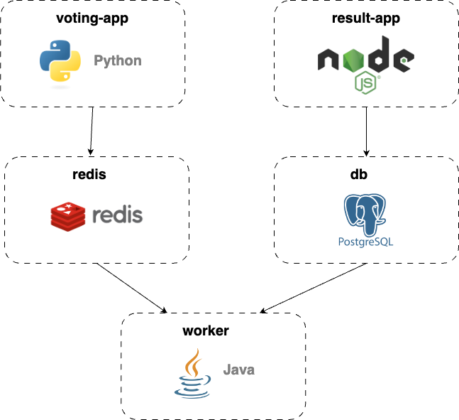

# Voting App Infrastructure

The **Voting App** is a demonstration of a modern cloud-native application, structured around microservices to ensure scalability, high availability, and resilience. The architecture is optimized to run in a Docker Swarm environment, leveraging containerized services and cloud-native patterns to deliver a fault-tolerant voting platform.

This app includes a collection of microservices that work together to create a seamless voting experience. With **PostgreSQL** as the persistent database and **Redis** for fast in-memory storage and message brokering, the infrastructure is built to handle real-time voting processes efficiently.

## Project Overview

The Voting App is a sample application developed to demonstrate:

- **Microservices Architecture**: Each service runs independently, scaling as needed based on workload.
- **Service Orchestration**: Managed through Docker Swarm, which ensures automatic recovery, scaling, and deployment of services.
- **Resilient Data Management**: Combining PostgreSQL and Redis to manage both temporary and permanent data storage with high availability.
- **Dynamic Service Discovery**: Traefik, a dynamic reverse proxy, automatically routes and balances traffic across services, providing HTTPS termination and security through Let's Encrypt.

## Services Overview

- **Vote Service**: A front-end web application where users can cast votes. It serves as the user-facing entry point of the app.
- **Worker Service**: A .NET-based background processor that consumes votes from Redis and stores them in the PostgreSQL database.
- **Result Service**: A Node.js application responsible for displaying real-time voting results, showing users how the voting trends are shaping up.
- **PostgreSQL Database**: Manages permanent storage of voting results. Configured for high availability with replication and failover.
- **Redis Cluster**: Handles temporary storage of vote data and acts as a message broker between the vote and worker services for efficient processing.

## Infrastructure Details

### 1. Traefik as Reverse Proxy

**Traefik** is used for dynamic service discovery and routing within the Docker Swarm environment. It manages incoming requests, balancing them across services based on traffic and availability.

- **SSL Support**: Traefik automatically generates and manages SSL certificates through Let's Encrypt, ensuring all communication is secure.
- **Service Routing**: It defines routing rules for services based on hostnames, ensuring traffic is directed to the appropriate service (Voting or Results).

### 2. PostgreSQL as Database Backend

PostgreSQL is deployed with high availability using Bitnami’s PostgreSQL image, enhanced with **Replication Manager (repmgr)** to ensure automatic failover.

- **Replication**: Set up as master-slave replication to ensure data redundancy and prevent data loss.
- **Pgpool**: This component balances the load across the database nodes, handling multiple concurrent connections and improving performance.

### 3. Redis for Caching and Message Brokering

Redis operates as both a caching layer and a message broker, using a master-slave architecture to ensure reliability and fast data access.

- **High Availability**: Redis Sentinel monitors the health of the nodes and automatically promotes a slave to master in case of failure.
- **Load Balancing**: **HAProxy** is used to distribute the load across Redis instances, maximizing efficiency and response times.

## Key Features of the Voting App

- **Microservices-Based**: Each service is independently deployable, allowing the infrastructure to scale efficiently.
- **Scalable and Resilient**: With Docker Swarm managing service orchestration, the app is highly available and capable of handling increased traffic without downtime.
- **High Availability**: PostgreSQL and Redis are configured with high-availability mechanisms like replication and failover to ensure data is always accessible and the app remains operational.
- **HTTPS Security**: Secure communication between users and services is ensured through Traefik’s integration with Let's Encrypt for automatic certificate management.

